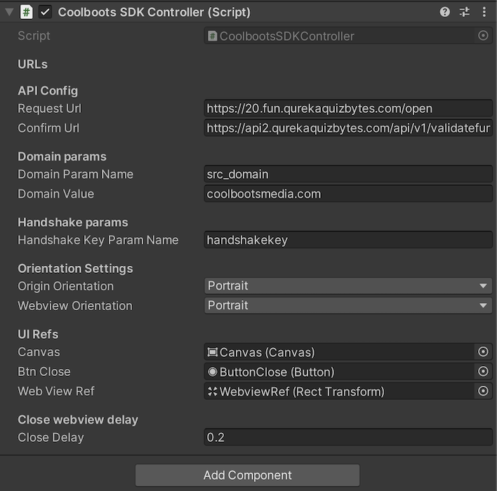

# CoolbootsSDK Manual

## CoolbootsSDK Prefab config



## Generate the unique key which is getting used in url as a dynamic value
The dynamic value(handshakekey) is generated with MD5 algorithm with input is a formatted string. Check below: <br>
```
var formattedString = SystemInfo.deviceUniqueIdentifier + DateTime.Now + Random.Range(0, 10000);
var md5key = Utils.StringToMD5(formattedString);
```

And MD5 generator function: 
```
public static string StringToMD5(string input) {
    var hash = new StringBuilder();
    var md5provider = new MD5CryptoServiceProvider();
    var bytes = md5provider.ComputeHash(new UTF8Encoding().GetBytes(input));

    foreach (var b in bytes) {
      hash.Append(b.ToString("x2"));
     }

      return hash.ToString();
 }
```

## Open Request url(20.fun) in uniwebview
The Request URL(20.fun) prefix is defined by CoolbootsSDK Prefab config in inspector(please see the first screenshot, param Request Url).

Full URL is indentied with format:

```
var fullURL = $"{RequestUrl}?{domainParamName}={domainValue}&{handshakeKeyParamName}={md5key}";
```

And call request buy using Instance of CoolbootsSDKController

```
CoolbootsSDKController.Instance.CallRequest(completeAction, failAction);
```

Example by 4096 3D project:
```
CoolbootsSDKController.Instance.CallRequest(watchedVideo, closeUI);
```

And it will do the stuff.

## Keep orientation of uniwebview only in portrait
The orientation is configured in Prefab inspector


Origin Orientation is your default game/app orientation.
WebviewOrientation is your expected orientation in your webview.

## Detect the event triggering on close button
When close button is triggered/clicked, it'll call verify api to check the result. If it's 200 response, completeAction function will be invoked else failAction will be invoked. Check actions in "Open Request url(20.fun) in uniwebview"

## Close the uniwebview tab
Closing the UniWebView is auto triggered now(by current logic flow). Or you can force close by the following code:

```
CoolbootsSDKController.Instance.CloseWebview();
```

```
public void CloseWebview() {
    ResetAllParams();
    if (webView) {
        webView.Stop();
        webView.Hide();
        Destroy(webView);
        webView = null;
    }
    _canvas.gameObject.SetActive(false);
    _completeAction?.Invoke();
    if (Screen.orientation != _originOrientation) Screen.orientation = _originOrientation;
}
```

## Hit the api url to check the status for reward
This url (called verify url) can be filled in Unity inspector. It's call when user hit close button.
